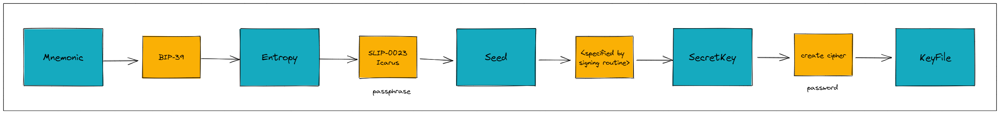

## Key generation specification
This section describes Topl's process for secret key generation over all supported signature routines. 
For information on signing routines and test vectors please refer to `/signing`.

Generation of secret keys is a multi-step process that allows for the creation of random and hierarchical determinstic key pairs. 
To allow a single key generation process to be applicable across all supported signing routines, we separately define a specification for [**root key generation**](###root-key-generation) (applicable to all routines) and [**child key derivation**](###child-key-derivation) (applicable only to Extended25519 keys).

### Root key generation
While Topl supports several different secret key types and signing constructions, we have standardized the creation of each type of root key to improve developer usability and provide a process for forward compatibility.

Below is a summary of the root key generation process 


 
Using this figure we identify 3 separate stages involved in the creation of root key pairs. 
1. Mnemonic to Entropy
    - [Specification](/specs/crypto/generation/mnemonic/MnemonicToEntropy.md)
    - [Test vectors](/specs/crypto/generation/mnemonic/MnemonicToEntropy.json)
1. Entropy to Seed
    - [Specification](/specs/crypto/generation/mnemonic/EntropyToSeed.md)
    - [Test vectors](/specs/crypto/generation/mnemonic/EntropyToSeed.md)
1. Seed to SecretKey
    - [Specification](/specs/crypto/generation/SeedToSecretKey.md)
    - Note: We do not separetly define test vectors for `Seed => SecretKey`

The above process was adopted from [Slip-0023 Icarus](https://github.com/satoshilabs/slips/blob/master/slip-0023.md#cardano-icarus-master-node-derivation) and may be summarized as
```
1. Let M be a BIP-0039 mnemonic and P the passphrase entered by the user. ----------------| Mnemonic
2. Determine the initial entropy E that was used to generate M. --------------------------| to Entropy

3. Compute Seed = PBKDF2-HMAC-SHA512(password = P, salt = E, iter = 4096, dkLen = 96). ---| Entropy to Seed

4. Modify S to be a valid secret key for the signing routine -----------------------------| Seed to SecretKey
```
Using this algorithm we fully specify the process from `Mnemonic => SecretKey`.
Test vectors are provided below with mnemonics and root secret key values for all supported signing routines.

[Mnemonic to SecretKey test vectors](####mnemonic-to-secretkey)


### Child key derivation
The Tetra era of the Topl protocol will delegate end-user bearer level authentication to use hierarchical deterministic wallets based on the Edwards 25519 (Ed25519)


Therefore Topl IS NOT BIP-32 or BIP-44 compatible as this standard is specified for the elliptic curve `secp256k1`[1](https://github.com/bitcoin/bips/blob/master/bip-0032.mediawiki#conventions). 
Topl follows an algorithm known as [Bip32-Ed25519](/specs/crypto/generation/Ed25519_BIP Final.pdf) for child key derivation.
The Cardano network similarly provide HD key support using this scheme and as such have defined [CIP-1852](https://cips.cardano.org/cips/cip1852/) which specifies that `purpose = 1852'`
Furthermore, Topl has chosen `coin type = 7091'`

using a derivation path 


This implementation conforms to [SLIP-0023 Icarus](https://github.com/satoshilabs/slips/blob/master/slip-0023.md#cardano-icarus-master-node-derivation) for root key generation and . See [here](/specs/crypto/generation/readme.md) for more information.

 of secret keys by adhering to

### Definitions
#### Mnemonic
Mnemonic refers to a BIP-39 compatible 12, 15, 18, 21, or 24 word phrase. 
Please refer to [root key generation](###root-key-generation) below for details on its usage. 
Since *mnemonic* is an oft used term, we define a `Phrase` as

```scala
/** A mnemonic phrase of words from a valid language list.
 * 
 * @param value the sequence of words in the mnemonic phrase
 * @param size provides the expected number of words, bits of entropy, and checksum length
 * @param languageWords the BIP-39 compatible word list for a supported language
 */
case class Phrase(value: IndexedSeq[String], size: MnemonicSize, languageWords: LanguageWordList)

sealed abstract class MnemonicSize(val wordLength: Int) {
  val checksumLength: Int = wordLength / 3
  val entropyLength: Int = 32 * checksumLength
}

object MnemonicSizes {
  case object `12` extends MnemonicSize(12)
  case object `15` extends MnemonicSize(15)
  case object `18` extends MnemonicSize(18)
  case object `21` extends MnemonicSize(21)
  case object `24` extends MnemonicSize(24)
}

//a list of all 2048 words in the word list for a certain language
class LanguageWordList(val value: IndexedSeq[String])
```

#### Entropy
Entropy is a byte array input to a hardened key derivation function and is isomorphic with a mnemonic phrase. 
Please refer to [root key generation](###root-key-generation) below for details on its usage. 
The length of `Entropy` may be one of `16, 20, 24, 28, 32` bytes, therefore we simply define it as
```scala
case class Entropy(value: Bytes)
```

#### Seed
Seed is a byte array output from a hardened key derivation function and it is used as the input to the routine-specific secret key derivation process. 
Here we use the label *Seed* instead of *Key* to avoid ambiguity with *SecretKey* (or verification key).

As outlined in the [Entropy to Seed](/specs/crypto/generation/mnemonic/EntropyToSeed.md) specification, Topl uses [PBKDF2-SHA512](https://en.wikipedia.org/wiki/PBKDF2) with a 96 byte output length. Therefore `Seed` is defined as

```scala
case class Seed(bytes: Sized.Strict[Bytes. Lengths.`96`.type])
```

#### SecretKey
Secret keys are defined for each of the different signing constructions as simple data models given in `co.topl.models.SecretKeys` ([Scala ref. impl.](https://github.com/Topl/Bifrost/blob/tetra/models/src/main/scala/co/topl/models/SecretKey.scala)).

These models are defined as
```scala
object SecretKeys {
  case class Curve25519(bytes: Sized.Strict[Bytes, Lengths.`32`.type]) extends SecretKey

  case class Ed25519(bytes: Sized.Strict[Bytes, Lengths.`32`.type]) extends SecretKey

  case class ExtendedEd25519(
    leftKey:   Sized.Strict[Bytes, Lengths.`32`.type],
    rightKey:  Sized.Strict[Bytes, Lengths.`32`.type],
    chainCode: Sized.Strict[Bytes, Lengths.`32`.type]
  ) extends SecretKey

  case class VrfEd25519(bytes: Sized.Strict[Bytes, Lengths.`32`.type]) extends SecretKey

  case class KesSum(tree: KesBinaryTree, offset: Long) extends SecretKey

  case class KesProduct(
    superTree:    KesBinaryTree, // Hour hand
    subTree:      KesBinaryTree, // Minute hand
    nextSubSeed:  Array[Byte],
    subSignature: Proofs.Knowledge.KesSum,
    offset:       Long
  ) extends SecretKey
}
```

### Test vectors
#### Mnemonic to SecretKey